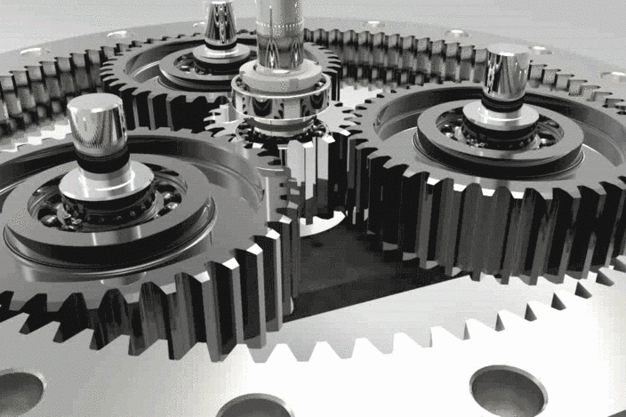

# 💫 Hi there 👋 I’m SxMec, ⚙️🚀 Mechatronics Engineer!
👯 Open to collaboration on projects that explore innovative robotics and automation solutions.  
🤝 Eager to learn and improve in areas like control systems, AI integration, and embedded systems.  
💬 Happy to discuss topics like mechatronics, industrial automation, and emerging trends in engineering.  
⚡ Fun fact: I enjoy turning ideas into reality through code and experimenting with new technologies in robotics!

## 🌐 Socials:
 

<!-- ### Ẩn (commented out)

-->

# ⚙️ Tech Stack:
 
 
 
 
 
 

  
  
 
 

 
 
 
  

# 📊 GitHub Stats:
<table style="width: 100%; table-layout: auto;">
  <tr>
    <td width="50%" style="padding: 0;">
      
      
    </td>
    <td style="padding: 0; width: auto;">
      
    </td>
  </tr>
</table>

---

<!-- Proudly created with GPRM ( https://gprm.itsvg.in ) -->
