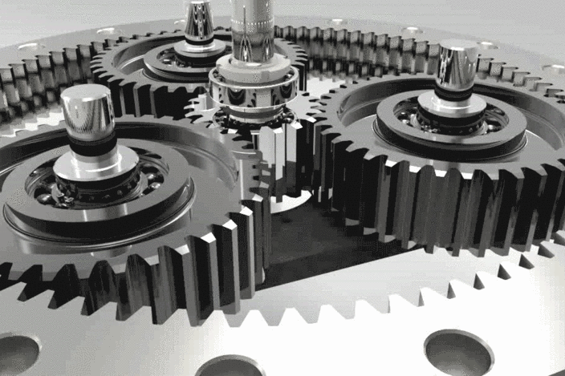

# 💫 Hi there 👋 I'm Aster Huynh. 
⚙️ Piping Engineer with a background in Mechatronics Engineering.
🏭 I design piping systems, develop engineering documentation, and work with industrial plant projects.
💻 Passionate about engineering software, CAD automation, AI, and building tools that simplify engineering workflows.
🚀 Currently exploring Plant 3D customization, Navisworks, Python, C#, and engineering automation.
🤝 Open to collaborating on engineering software, automation, CAD tools, and industrial digitalization.
💬 Ask me about Piping Engineering, AutoCAD Plant 3D, Navisworks, Mechanical Design, Automation, Robotics, and Programming.
⚡ I believe great engineering comes from combining practical experience with continuous learning and innovation.

## 🌐 Socials:
 

<!-- ### Ẩn (commented out)

-->

# ⚙️ Tech Stack:
 
 

 
 
 
 
 
 
 
 
 

# 📊 GitHub Stats:
<table style="width: 100%; table-layout: auto;">
  <tr>
    <td width="50%" style="padding: 0;">
      
      
    </td>
    <td style="padding: 0; width: auto;">
      
    </td>
  </tr>
</table>

---

<!-- Proudly created with GPRM ( https://gprm.itsvg.in ) -->
